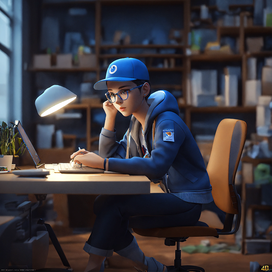

## Ваня — Молодой сотрудник с небольшим опытом работы

> «Хочу чувствовать, что двигаюсь вперёд, а не просто закрываю задачи»

Недавно начал карьеру, пришёл в компанию с ожиданиями активной среды, где все «на одной волне». Стремится к профессиональному росту и развитию, но иногда сталкивается с разочарованиями из-за однообразной или рутинной работы.

### Демография
- Возраст: 19–22 года  
- Опыт работы: до 2 лет
- Роль: младший специалист / стажёр / джуниор  
- Образование: только окончил ВУЗ или ещё учится  

### Цели и мотивация
- Быстро развиваться и прокачивать навыки.
- Хочет получать признание за вклад.
- Стремится стать «своим» в коллективе.
- Хочет ощущать, что его работа имеет значение.
- Хочет брать задачи сложнее.

### Боли и фрустрации
- Монотонные задачи, не дающие развиваться.
- Недостаточно обратной связи и признания.
- Непонимание, как расти внутри компании.
- Слабая вовлечённость в корпоративную культуру.
- Страхи, что его вклад неважен.

### Поведение в контексте геймификации
- Ищет лёгкие и понятные механизмы вовлечения.
- Мотивирован короткими циклами наград (бейджи, уровни, признание).
- Может активно участвовать в челленджах и мини-играх.
- Хорошо реагирует на социальное признание (таблицы лидеров, shout-outs от коллег и руководства).

## Елена — Сотрудник-милениал

> «Мне важен баланс между работой и личной жизнью, и мотивация должна помогать, а не мешать сосредоточиться»

Уже не джун, но всё ещё в курсе современных трендов. Ценит баланс между работой и личной жизнью. Открыт к новым методам мотивации, однако требует, чтобы эти подходы были гибкими и не отвлекали от основной работы. Геймификация для этого сотрудника — не способ развлечения, а инструмент признания заслуг.

### Демография (пример)
- Возраст: 23–35 лет  
- Опыт работы: 2–5 лет  
- Роль: специалист среднего звена / мидл  
- Образование: высшее или дополнительное профессиональное  

### Цели и мотивация
- Поддерживать здоровый баланс между работой и личной жизнью.  
- Получать признание за профессиональные достижения.  
- Использовать эффективные и ненавязчивые способы мотивации.  
- Быть в курсе современных трендов и технологий.

### Боли и фрустрации
- Навязчивые или слишком активные геймификационные механики, отвлекающие от работы.  
- Отсутствие гибкости в мотивационных инструментах.  
- Чувство выгорания из-за постоянного давления.  
- Недостаток признания заслуг.

### Поведение в контексте геймификации
- Ориентирован на механики связанности — например, командные достижения, совместные челленджи.  
- Предпочитает, чтобы геймификация помогала подчеркнуть успехи без излишнего шума.  
- Готов участвовать в мотивационных программах, если они не мешают рабочему процессу.  
- Ценит прозрачность и справедливость в системе наград.

## Александр Сергеевич — опытный сотрудник с большим стажем работы

> «Для меня главное — стабильность и честное вознаграждение за мой труд, а не всякие игры. Зарплату платите больше — будет вам мотивация»

Александр ценит стабильность и за годы работы привык к определённому ритму. Его мотивация связана прежде всего с надёжной зарплатой (чем больше, тем лучше) и комфортными условиями труда. Он скептически относится к инновационным методам вовлечения, включая геймификацию, но готов использовать систему, если она предлагает реальные финансовые или карьерные преимущества и будет легкой в понимании. При этом он может быстро расстроиться, если система окажется непонятной или несправедливой.

### Демография (пример)
- Возраст: 45–65 лет  
- Опыт работы: более 15 лет  
- Роль: старший специалист / эксперт / руководитель среднего звена  
- Образование: высшее профессиональное (специалитет)

### Цели и мотивация
- Получать справедливое финансовое вознаграждение.  
- Сохранять стабильность и уверенность в завтрашнем дне.  
- Работать в комфортных и предсказуемых условиях.  
- Избегать лишних изменений и нововведений без явной пользы.

### Боли и фрустрации
- Недоверие к новым и непроверенным методам мотивации.  
- Быстрая фрустрация при сложных или непрозрачных системах.  
- Перегрузка изменениями, которые мешают привычному ритму работы.  
- Отсутствие ощутимых выгод от новых инициатив.

### Поведение в контексте геймификации
- Скептически относится к игровым элементам и легким мотивационным приемам.  
- Готов подключиться к системе, если она предлагает реальные финансовые или карьерные бонусы.  
- Ожидает простоты и прозрачности в правилах и наградах.  
- Быстро теряет интерес при сложных или непонятных механиках.

## Персона: Павел — линейный руководитель

> «Я хочу создать такую команду, где каждый будет мотивирован и заинтересован в общем результате»

Павел — молодой линейный руководитель, который активно ищет способы улучшить командную атмосферу и повысить мотивацию сотрудников. Он открыт к инновационным методам управления, понимает, что традиционные практики имеют свои ограничения и стремится к гибким решениям для эффективной работы команды.

### Демография (пример)
- Возраст: 23–35 лет   
- Опыт работы: 5–10 лет (в том числе управленческий опыт)  
- Роль: линейный руководитель / тимлид  
- Образование: высшее профессиональное, возможно учится в аспирантуре или MBA

### Цели и мотивация
- Повысить вовлечённость и продуктивность команды.  
- Улучшить коммуникацию и атмосферу внутри коллектива.  
- Использовать инновационные инструменты мотивации и развития.  
- Добиваться конкретных результатов через эффективное управление.

### Боли и фрустрации
- Ограниченность традиционных менеджерских практик.  
- Сложности с мотивацией разных по характеру сотрудников.  
- Неоднородность команды и конфликты.  
- Недостаток инструментов для быстрого и прозрачного контроля.

### Поведение в контексте геймификации
- Активно поддерживает использование геймификационных механик для команды.  
- Оценивает эффективность новых подходов по результатам и вовлечённости.  
- Предпочитает гибкие и настраиваемые механики, которые можно адаптировать под команду.  
- Использует геймификацию как инструмент признания и повышения командного духа.

## Персона: Даша — HR-администратор системы

> «Мне важно, чтобы система была простой в управлении и помогала видеть реальную картину вовлечённости сотрудников»

Даша отвечает за внедрение и поддержку системы геймификации в компании. Для неё важно, чтобы система была максимально удобной в управлении и легко интегрировалась с уже существующими инструментами. Она заинтересована в функциональности и прозрачности системы, чтобы иметь доступ к данным для анализа эффективности и уровня вовлечённости сотрудников.

### Демография (пример)
- Возраст: 22–40 лет  
- Опыт работы: 3–12 лет в HR и администрировании  
- Роль: HR-администратор / специалист по внедрению HR-систем  
- Образование: высшее, возможно дополнительное в области управления или ИТ  

### Цели и мотивация
- Обеспечить беспроблемное внедрение и поддержку системы.  
- Гарантировать интеграцию с другими инструментами компании.  
- Получать точные и понятные данные для анализа вовлечённости.  
- Повысить эффективность мотивационных программ через систему.

### Боли и фрустрации
- Сложности с настройкой и интеграцией новых систем.  
- Непонятный или перегруженный интерфейс управления.  
- Недостаток прозрачности и отчетности.  
- Технические сбои и ограниченные возможности кастомизации.

### Поведение в контексте геймификации
- Активно взаимодействует с командой разработчиков и пользователей системы.  
- Оценивает удобство и функциональность интерфейса.  
- Следит за корректностью данных и их полнотой.  
- Продвигает использование системы среди сотрудников, поддерживая обучение и помощь.

## Сергей Викторович — руководитель высшего уровня

> «Мне нужны прозрачные и понятные данные, чтобы видеть, кто действительно вносит вклад в успех компании»

Сергей Викторович — руководитель высшего звена, который заинтересован в том, чтобы система геймификации обеспечивала прозрачные данные о производительности сотрудников и позволяла быстро выявлять лучших исполнителей. Для него важно, чтобы инструменты мотивировали команду, повышали общую эффективность и улучшали бизнес-результаты.

### Демография (пример)
- Возраст: 45–55 лет  
- Опыт работы: более 20 лет, из них 10+ на управленческих позициях  
- Роль: топ-менеджер / директор
- Образование: высшее управленческое, MBA

### Цели и мотивация
- Получать точные и прозрачные отчёты о работе сотрудников.  
- Быстро выявлять и поддерживать лучших исполнителей.  
- Повышать общую эффективность и результативность компании.  
- Использовать современные инструменты для мотивации и управления.

### Боли и фрустрации
- Недостаток точных и своевременных данных для принятия решений.  
- Сложности с оценкой вклада отдельных сотрудников и команд.  
- Ограниченная видимость эффективности мотивационных программ.  
- Риски потери ключевых сотрудников из-за недостаточной мотивации.
- Не любит тратить время на долгую аналитику.

### Поведение в контексте геймификации
- Ожидает удобных и информативных дашбордов и отчетов.  
- Поддерживает внедрение систем, которые улучшают бизнес-показатели.  
- Следит за тем, чтобы геймификация приносила реальную пользу компании.  
- Использует данные системы для стратегического планирования и мотивации.
